```{r libs, include=FALSE}
library(knitr)
library(tidyverse)
library(xaringan)
library(magick)
library(icons)
library(xaringanExtra)

xaringanExtra::use_share_again() # need to get the slide button on html view

opts_chunk$set(
  echo = FALSE,
  eval = FALSE,
  message = FALSE,
  warning = FALSE,
  fig.width = 7.252,
  fig.height = 4,
  dpi = 300,
  dev.args = list(type = "cairo")
)

```

class: title-slide, left, bottom

# `r rmarkdown::metadata$title`
----
## **`r rmarkdown::metadata$subtitle`**
### `r rmarkdown::metadata$author`
### `r rmarkdown::metadata$date`

---

class: center, middle


# Agenda
Using R Studio <br/>
<br/> Importing data <br/>
<br/> --------- Break --------- <br/>
<br/> Introduction to ggplot2 <br/>
<br/> What does this function do? <br/>
<br/> --------- Lunch ----------- <br/>
<br/> Data wrangling with dplyr <br/>
<br/> Naming objects | Relational data <br/>
<br/> --------- Break --------- <br/>
<br/> R Markdown <br/>
<br/> Ongoing learning <br/>
<br/> .green[Finish about 4 - 430pm] <br/>

---

class: center, middle

# Course Aims
</br>
####1. To show you some of the possibilities:
####2. To give you a feel for how R works.
####3. To show you enough for you to begin teaching yourself
_(Excellent free resources available)_


---

class: inverse, middle, center


.left-col[.center[
###_elegant_
#Graphics
]]

---

[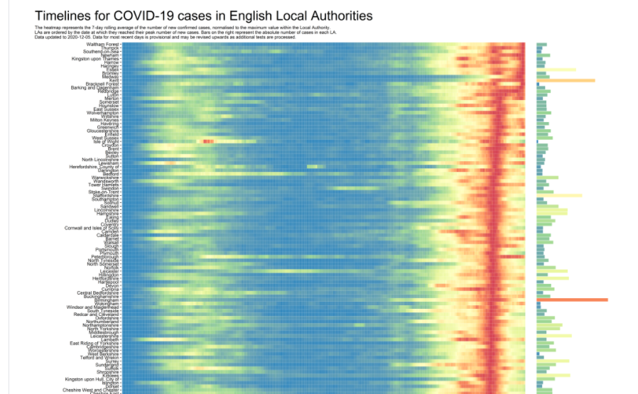](https://github.com/VictimOfMaths/COVID-19)

---
The original blog is no longer available that featured this

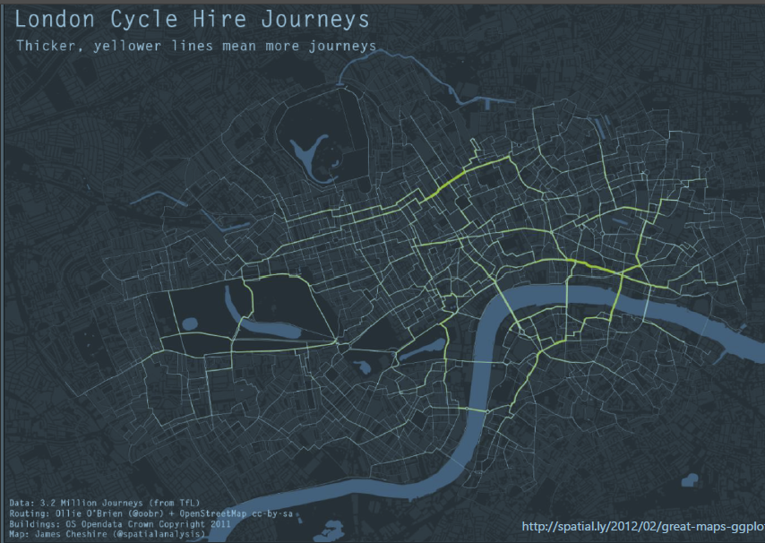

---

class: center, middle

# Collaboration
<br/>

`r icons::fontawesome("arrow-down")`

## Reproducibility

`r icons::fontawesome("arrow-down")`

### R Markdown

---

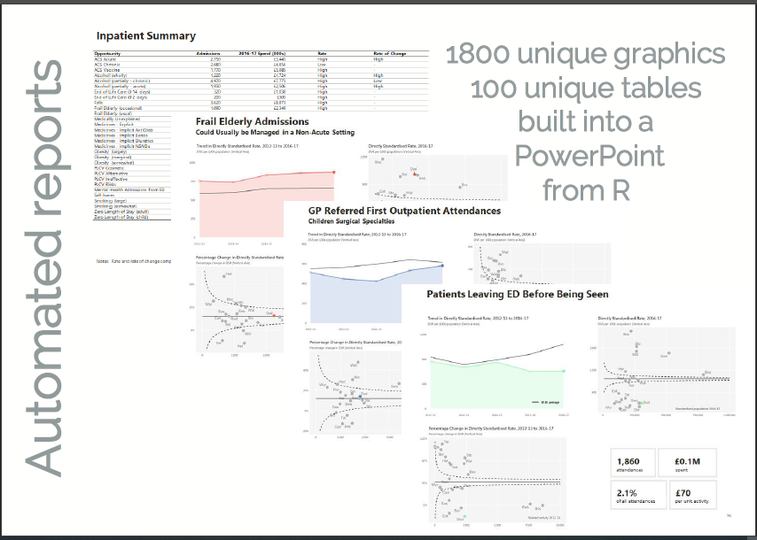

---

# (Interactive) Dashboards

[Mental Health Surge Modelling](https://strategyunit.shinyapps.io/MH_Surge_Modelling/)


---

[Trafford Data Lab](https://trafforddatalab.shinyapps.io/trafford-tweet-dash/) and the main [site](https://www.trafforddatalab.io/)

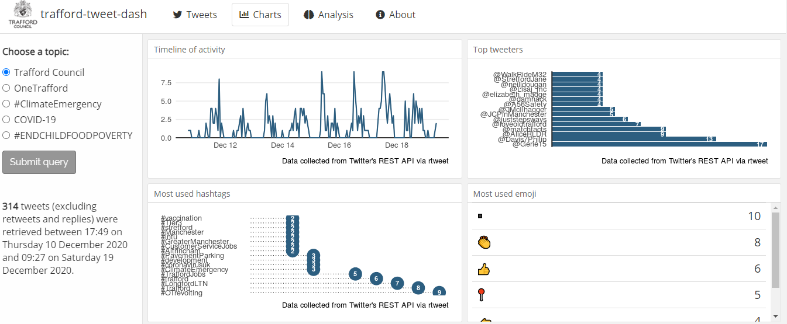

---

# R to SQL connection


[NHS-R Community Webinar](https://nhsrcommunity.com/learn-r/workshops/database-connections-in-r-webinar)

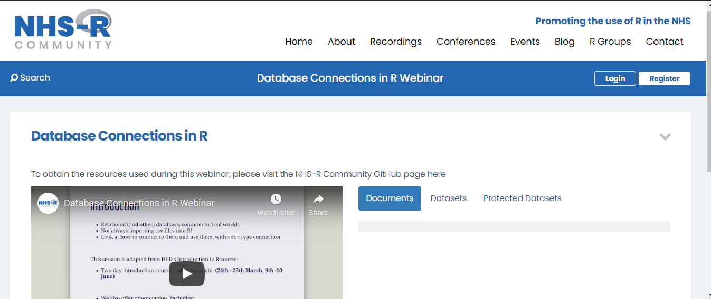

---

class: center, middle

# Inclusivity

```{r inclusive, eval=TRUE}

rladies <- magick::image_read('img/session01/r_ladies_twitter.PNG')
mir <- magick::image_read('img/session01/mir_twitter.PNG')
nhsr <- magick::image_read('img/session01/nhsr_twitter.PNG')

img <- c(rladies, mir, nhsr)

magick::image_animate(image_scale(img, "600x600"), fps = 1, dispose = "previous", loop = 6)

```

---

class: inverse, middle, center

.left-col[.center[
_elegant_
## Course Philosophy
]]

---

[Minimum Viable Product](https://blog.crisp.se/2016/01/25/henrikkniberg/making-sense-of-mvp)

.left-col[.center[
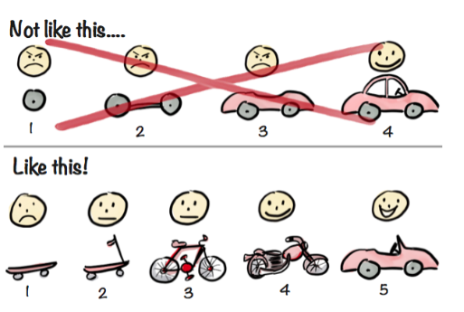
]]

---

class: center, middle

# Course philosophy

</br> Relaxed and informal </br>
</br> Slides and code are available on [`r icons::fontawesome("github")` original](https://github.com/nhs-r-community/intro_r) and [`r icons::fontawesome("github")` updated](https://github.com/Lextuga007/intro_r/tree/feature_conversion)) </br>
</br> The truth; but it can’t be the whole truth… </br>
</br> too much to cover in a day</br>

---

class: inverse, middle, center

# Let's begin

---

class: center, middle

## R vs. RStudio
</br> R is a programming language </br>
</br> RStudio is a software application with tools to </br>
</br> improve your programming experience

---

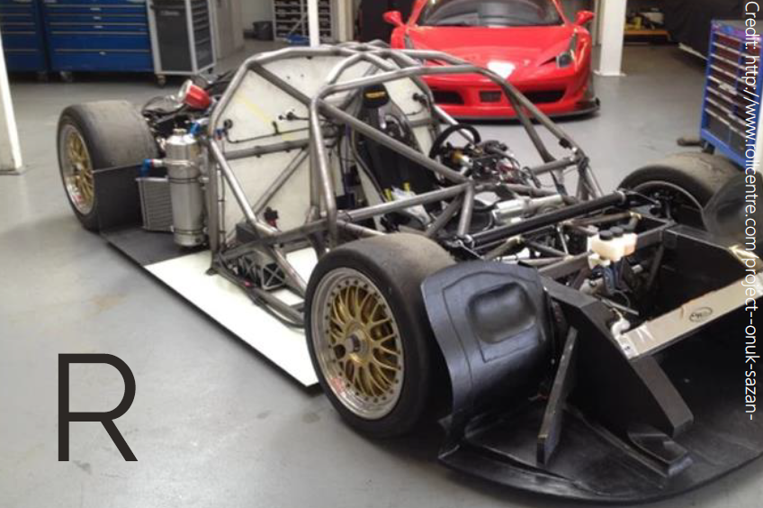

---


---

# RStudio 

</br>

</br> Many excellent features to help you with your analyses. </br>

</br> Never again have to think about R and RStudio as separate:
Opening R Studio opens an R session. </br>

</br> Analogy from the book Modern Dive:
[www.moderndive.com](www.moderndive.com)

---

class: center, middle

# Open RStudio

</br>
</br> R Studio opens an R session.

---

.left-column[
The Console is your window to R. </br>

</br> You can code directly in the console… </br>

</br> pi*2 <kbd> Enter </kbd> </br>
</br> 37/12 <kbd> Enter <kbd> </br>
</br> … but there is a better way…
]

.right-column[

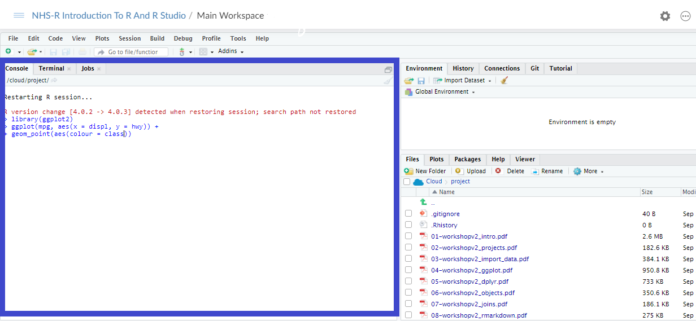

]

---

.left-column[

#### The Editor
</br>

</br> If you don’t see the Editor pane, click top right button </br>

</br> And choose "R Script" from the drop down.  </br>

</br> Or, shortcut:  </br>
<kbd> Ctrl + Shift + N </kbd> </br>
</br> .blue[_The cloud shortcut is <kbd> Ctrl + Shift + Alt + N </kbd>_]
]

.pull-right[

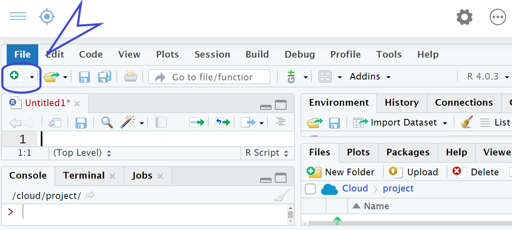

]
---

.left-column[
The Editor is just like any other text
editor: you can copy, paste, and save text. </br>

</br> <kbd> Ctrl + Z </kbd> undoes *but*
</br> <kbd> Ctrl + Shift + Z </kbd> to redo 
</br> (_not <kbd> Ctrl + y</kbd>_)

</br> Different text is coloured
(the console is uniform) </br>

</br> Autocomplete </br>

</br> <kbd>Ctrl + Enter </kbd>
(sends line of
code to Console)
]

.right-column[
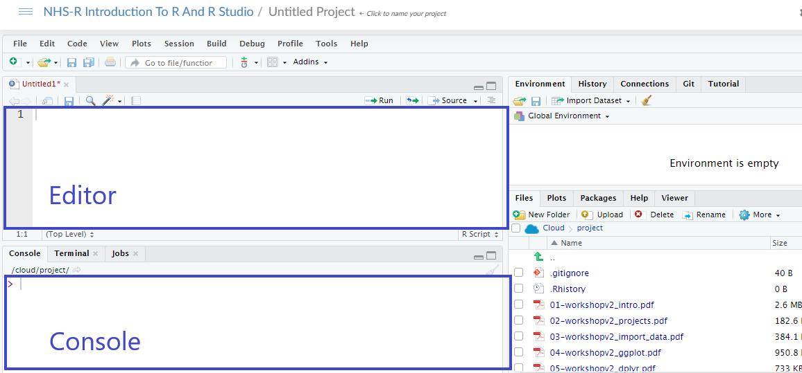
]

---

.left-column[
Comment code with a # </br>

</br> E.g # this was a
bad idea

Comment frequently, at least in the beginning

]

.right-column[

]

---

# Tools -> Options

[Reasons why this is default](https://community.rstudio.com/t/defaults-of-saving-and-restoring-workspace/939)

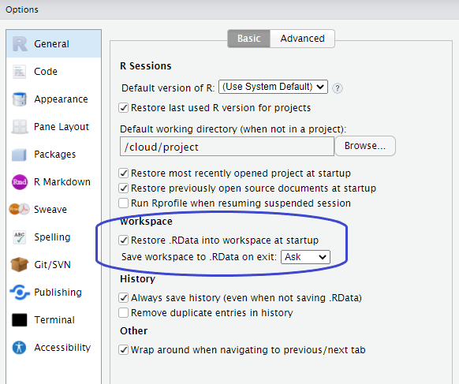

---

# Tools -> Options

Accessbility and comfort for all

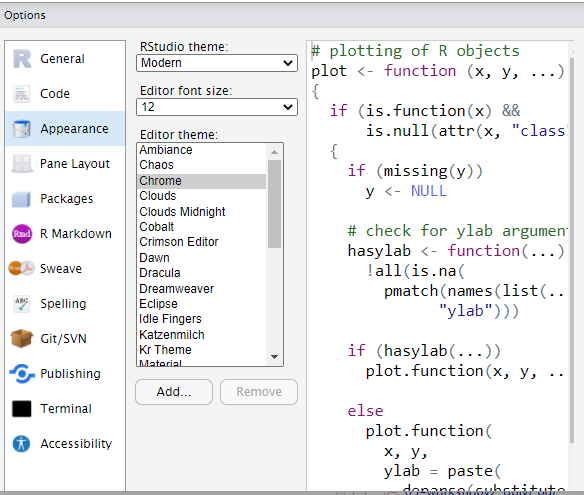

---

class: center, middle

# Packages

</br>
### R packages are like apps for your phone:
</br>

--

</br> Extend the capabilities of the basic or "base R" </br>
with extra functions, datasets, documentation.

---

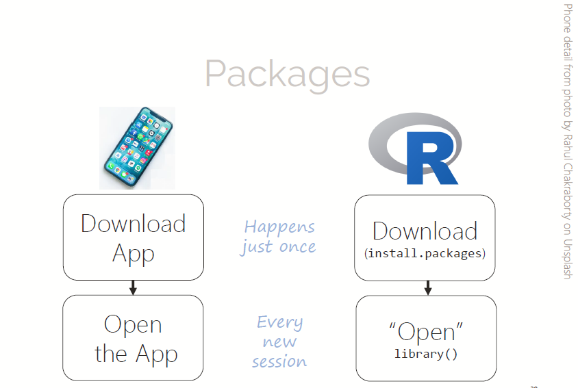

---

# Packages


```{r}
install.packages("tidyverse")

install.packages('tidyverse')
```

</br> will download a package to your personal library. Then: </br>

```{r}
library(tidyverse) 
```

This tells R to load the package from your personal library and is _needed for every new session/script_]

---

class: center, middle

## CRAN repository

</br> [Comprehensive R Archive Network](https://cran.r-project.org/web/packages/)
</br> 18,993 packages (March 2021). Free. Peer reviewed. </br>

</br> (Manifold possibilities) eg. interactive graphics and </br>
</br> dashboards, machine learning, mine twitter data, </br>
</br> create PowerPoint docs, maps… </br>
</br>
</br>

</br>.blue[Other ways to get packages (eg. GitHub `r icons::fontawesome("github")`)]

---

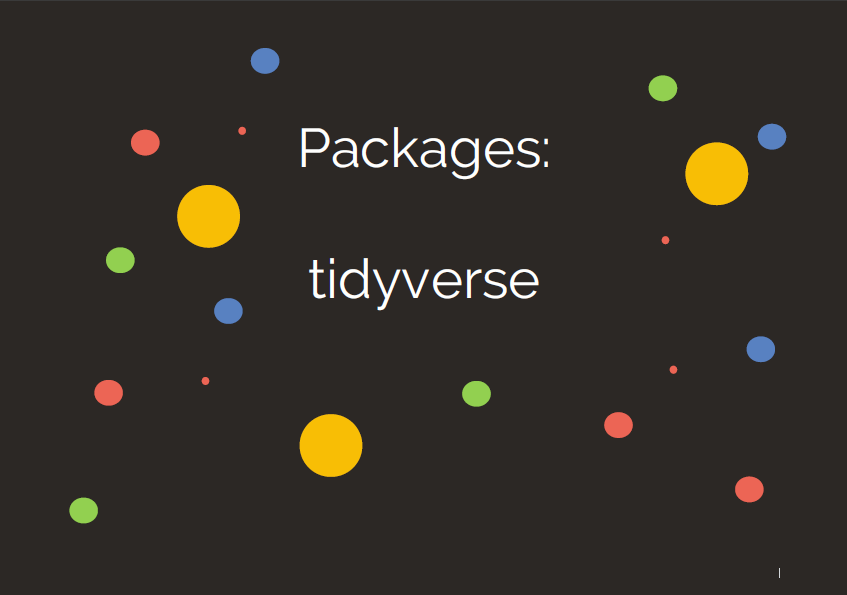

---

class: center, middle

## What is the tidyverse?
</br>

</br> The [tidyverse package](https://www.tidyverse.org/) collects (some of) the most popular </br>
R packages into one. </br>

</br> All have the same underlying principles: </br>

</br> Provide simple tools (with consistent structure) which may </br>
be used together to help solve complex problems.

---

class: center, middle

## What is the tidyverse?
</br>

</br> During the workshop we will use the [ggplot2](https://ggplot2.tidyverse.org/), [dplyr](https://dplyr.tidyverse.org/), </br>
and [readr](https://readr.tidyverse.org/) packages. These are bundled up in the </br>
tidyverse package. Load it by running: </br>
</br>

```{r}
library(tidyverse)
```

---

# Output

Information - what was loaded and potential conflicts

```
-- Attaching packages ------------------------------------------ tidyverse 1.3.0 --
v ggplot2 3.3.3     v purrr   0.3.4
v tibble  3.1.0     v dplyr   1.0.4
v tidyr   1.1.2     v stringr 1.4.0
v readr   1.4.0     v forcats 0.5.1
-- Conflicts --------------------------------------------- tidyverse_conflicts() --
x dplyr::filter() masks stats::filter()
x dplyr::lag()    masks stats::lag()
```

Warnings - not errors, just information on versions

```
Warning messages:
1: package ‘tidyverse’ was built under R version 4.0.4 
2: package ‘tidyr’ was built under R version 4.0.3 
3: package ‘readr’ was built under R version 4.0.3 
4: package ‘purrr’ was built under R version 4.0.3 
5: package ‘dplyr’ was built under R version 4.0.3 
6: package ‘stringr’ was built under R version 4.0.3 
```

---

#### This work is licensed as
</br> Creative Commons
</br> Attribution
</br> ShareAlike 4.0
</br> International
</br> To view a copy of this license, visit
</br> https://creativecommons.org/licenses/by/4.0/

---

name: goodbye
class: middle, inverse

# **Thank you!**

<br/> Acknowledgements: for creating the original training slides and delivering training:

Andrew Jones | Ozayr Mohammed <br/>
Healthcare Analysts | The Strategy Unit

[`r icons::fontawesome("paper-plane")` andrew.jones40@nhs.net](mailto:andrew.jones40@nhs.net)<br/>

[`r icons::fontawesome("paper-plane")` ozayr.mohammed@nhs.net](mailto:ozayr.mohammed@nhs.net)

And to Silvia Canelón who created the Xaringan presentation using NHS and NHR-R colour branding and shared this at the 2020 [NHS-R Community conference](https://spcanelon.github.io/xaringan-basics-and-beyond/index.html). <br/>

Details of the workshops she ran at the [NHS-R Community conference](https://spcanelon.github.io/xaringan-basics-and-beyond/index.html).

And to Zoë Turner who converted the presentation to Xaringan. [`r icons::fontawesome("paper-plane")` zoe.turner2@notthshc.nhs.uk](mailto:zoe.turner2@nottshc.nhs.uk) 
