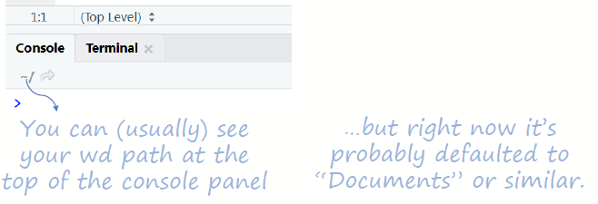
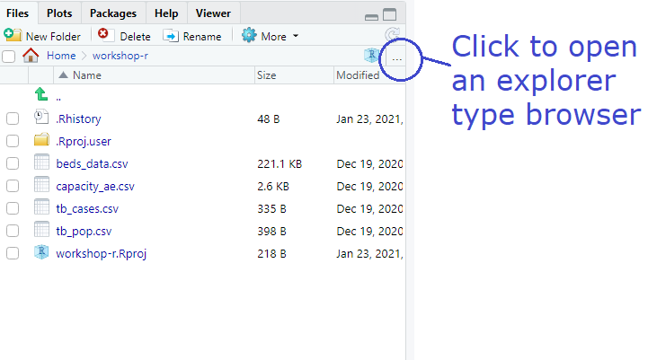
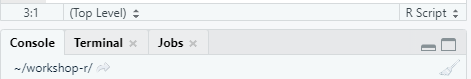
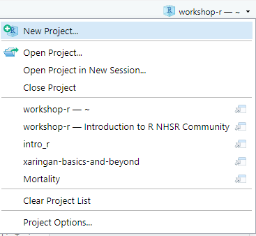

```{r libs, include=FALSE}

#knitr::opts_chunk$set(echo = FALSE, message = FALSE, warning = FALSE, results = 'asis')

#Runs packages if available
library(knitr)
library(tidyverse)
library(xaringan)

# Packages not on CRAN

# install.packages("remotes")
# remotes::install_github("mitchelloharawild/icons")
library(icons) # icons need to be loaded to view so run following code if not already done
# icons::download_fontawesome()

# install.packages("devtools")
#devtools::install_github("gadenbuie/xaringanExtra")
library(xaringanExtra)

xaringanExtra::use_share_again() # need to get the slide button on html view

opts_chunk$set(echo = FALSE,
               fig.width = 7.252,
               fig.height = 4,
               dpi = 300,
               dev.args = list(type = "cairo"))

```

class: title-slide, left, bottom


# `r rmarkdown::metadata$title`
----
## **`r rmarkdown::metadata$subtitle`**
### `r rmarkdown::metadata$author`
### `r rmarkdown::metadata$date`

.right-column[

.footnote[Artwork by @allison_horst]

]

---

# Working Directory

If you tell R/R Studio to look for a file, or save a plot, it will (by default) look in a place called the working
directory (wd) </br>

</br> 

</br> You can (usually) see your working directory path at the top of the console panel...</br>

</br> ... it often defaults to the "Documents" folder. </br>

</br> This example is ~/workshop-r/ and ~ is in Documents

---

# Browsing in RStudio

If you click the arrow next to the file pathway ~/workshop-r/

</br> 

it will return you to the working directory and you can see all the files in that folder:

</br> 

---

class: center, middle

# Organisation

</br> 

</br> Sooner or later (but probably sooner) you will wish to change where files are saved (and loaded from). </br>

</br> Being organised is key:</br>

</br> Reduces cognitive load (and frustration).

.footnote[Artwork by @allison_horst]

---

# RStudio Projects

</br> make it *far easier* for you to: </br>

</br> 1) .blue[*Organise*] files and workflow </br>
</br> 2) .blue[*Switch*] between projects </br>
</br> 3) .blue[*Share*] scripts / projects with others </br>


</br> .green[(when collaborating or getting assistance)] </br>

</br> Recommended for all tasks (large or small).

---

# Create a project

</br> File `r icons::fontawesome("arrow-right")` New Project `r icons::fontawesome("arrow-right")` New Directory `r icons::fontawesome("arrow-right")` New Project

</br> Name the directory "workshop-r" </br>
</br> Create as a subdirectory somewhere useful for you </br>
</br> Create project! </br>

---

# RStudio Projects

Now your working directory is your project directory:

</br> 

</br> R will save and load files from here (by default). </br>
</br> If starting another project, repeat this process.

---

class: middle, center

# R Studio Projects

Switching between projects is simple

</br> 

---

# Acknowledgements

Artwork by @allison_horst

#### This work is licensed as

</br> Creative Commons
</br> Attribution
</br> ShareAlike 4.0
</br> International
</br> To view a copy of this license, visit
</br> https://creativecommons.org/licenses/by/4.0/
