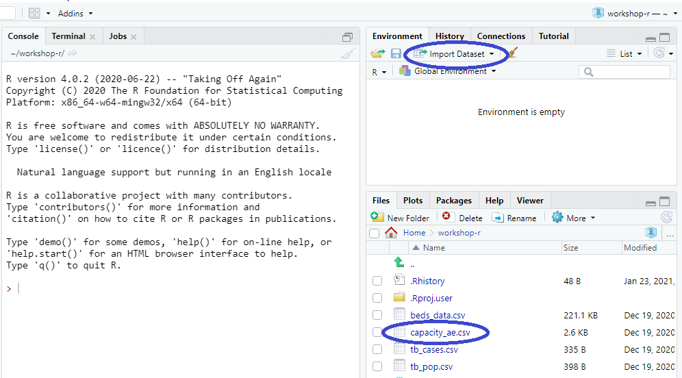
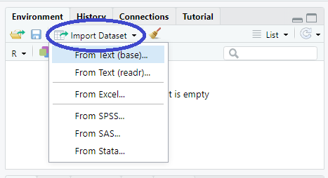
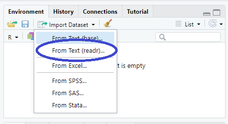
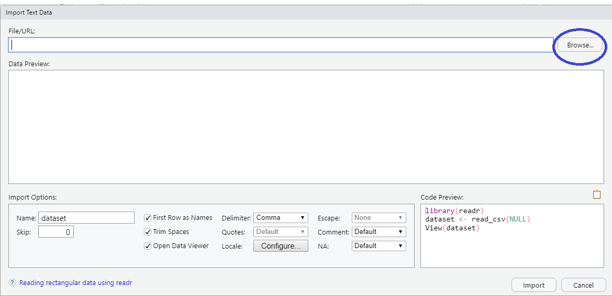
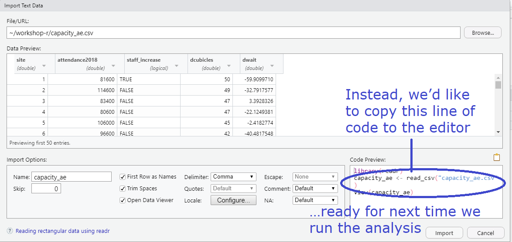
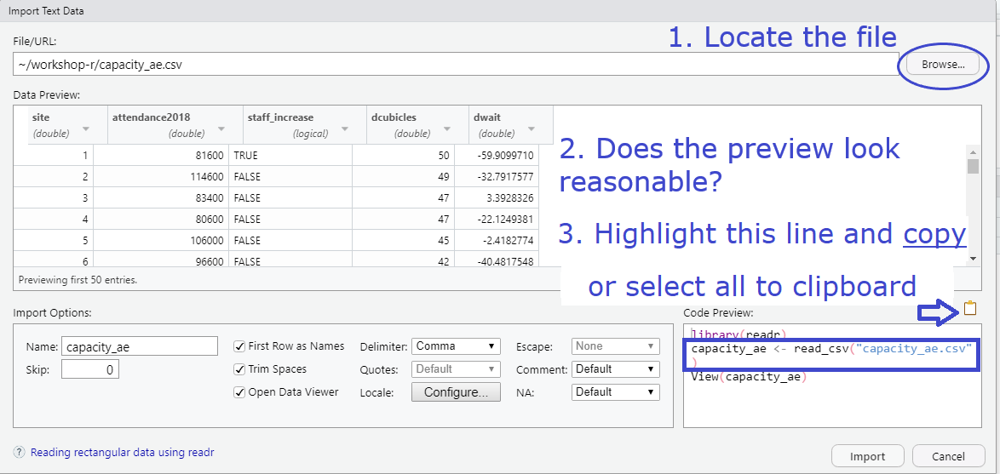
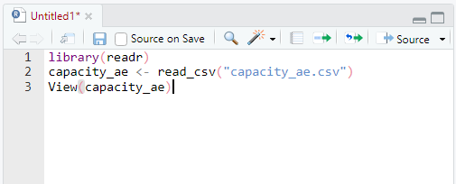
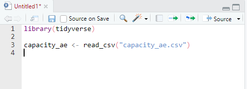
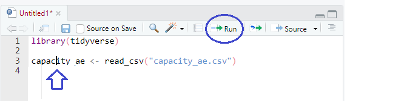

```{r libs, include=FALSE}
library(knitr)
library(tidyverse)
library(xaringan)
library(xaringanExtra)

xaringanExtra::use_share_again() # need to get the slide button on html view

opts_chunk$set(
  echo = FALSE,
  eval = FALSE,
  message = FALSE,
  warning = FALSE,
  fig.width = 7.252,
  fig.height = 4,
  dpi = 300,
  dev.args = list(type = "cairo")
)
```

class: title-slide, left, bottom

# `r rmarkdown::metadata$title`
----
## **`r rmarkdown::metadata$subtitle`**
### `r rmarkdown::metadata$author`
### `r rmarkdown::metadata$date`

.right-column[

]

---

class: center, middle

# Import data to R

</br> There are R packages to import all types of data. 
</br> In this course, we'll cover the most
</br> common imports: 
</br>
</br> csvs and Excel workbooks

--

</br> We'd like to import the `capacity_ae.csv` file. </br> 

</br> While we could write code from scratch to do this,
</br> it's often easier to get the import wizard to do this
</br> for you.

---

class: center, middle

# Import data to R

We will use the "Import Dataset" button (but you can also click on the file itself):

</br> 

---

# Import data to R

We will use the "Import Dataset" button:

</br> 

---

# Import data to R

The package used to install csvs is {readr} which is loaded with the {tidyverse} package.

Excel workbooks require the package {readxl}.

</br> 

---

# Import wizard

Locate the file capacity_ae.csv

</br> 

---

# Import wizard

</br> 

---

# Import wizard

</br> 

---

# Import wizard

</br> 

---

# Import wizard

</br> 

---

# Import wizard

Once copied then select .green[Cancel] and then .green[Paste].

.left-col[.left[

From the clipboard:


]]

--

.right-col-.right[

Where just one line copied:


]


---

# Run code from the editor

</br> 

No need to highlight all code to run.

</br>  Put the cursor in the line you want to run then select the button to Run or <kbd> Ctrl + Return </kbd>


---

#### This work is licensed as
</br> Creative Commons
</br> Attribution
</br> ShareAlike 4.0
</br> International
</br> To view a copy of this license, visit
</br> https://creativecommons.org/licenses/by/4.0/
