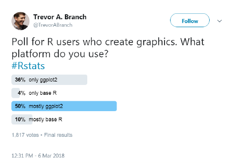
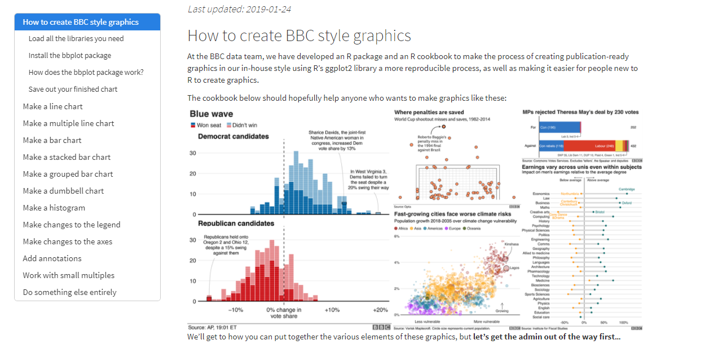
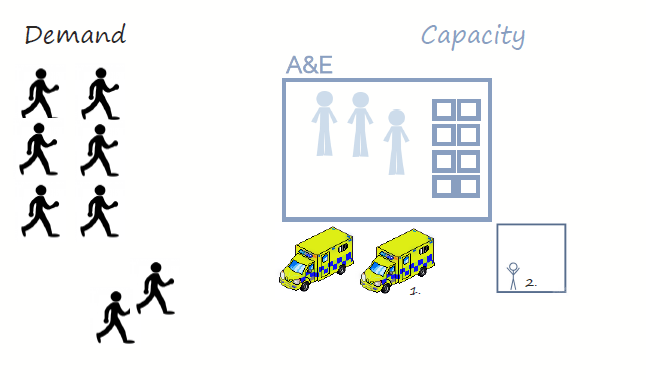
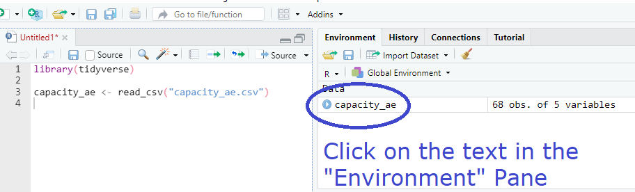
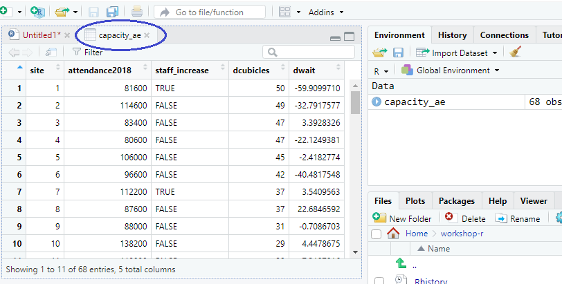
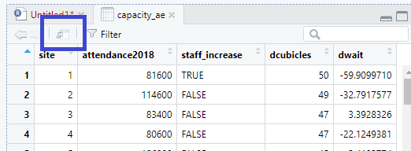
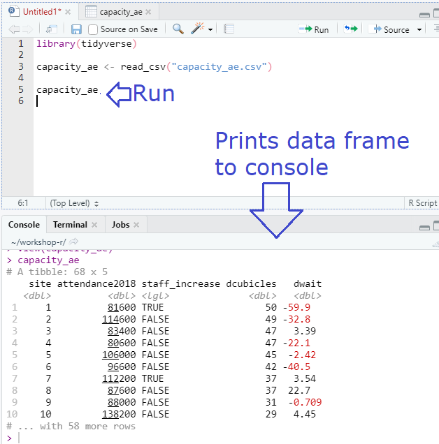
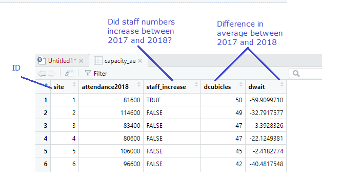
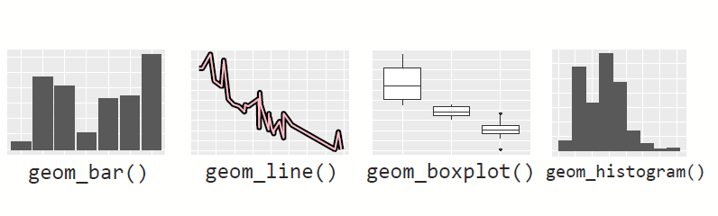

```{r libs, include=FALSE}
library(knitr)
library(tidyverse)
library(xaringan)
library(kableExtra)
library(icons)
library(xaringanExtra)

xaringanExtra::use_panelset()
xaringanExtra::use_clipboard()
xaringanExtra::use_share_again() # need to get the slide button on html view

opts_chunk$set(
  echo = TRUE,
  eval = FALSE,
  message = FALSE,
  warning = FALSE,
  fig.width = 7.252,
  fig.height = 4,
  dpi = 300,
  dev.args = list(type = "cairo")
)

# load data----------------------------------
capacity_ae <- read_csv(url("https://raw.githubusercontent.com/nhs-r-community/intro_r_data/main/capacity_ae.csv")) %>% 
  mutate(outliers = case_when(site %in% c(42, 25) ~ 1,
                              TRUE ~ 0))

```

class: title-slide, left, bottom


# `r rmarkdown::metadata$title`
----
## **`r rmarkdown::metadata$subtitle`**
### `r rmarkdown::metadata$author`
### `r rmarkdown::metadata$date`

.right-column[

]

.footnote[Artwork by @allison_horst]

---

# Acknowledgement

This session shadows [Chapter 3](https://r4ds.had.co.nz/data-visualisation.html) of the excellent:


---

# ggplot2

Is one of several plotting systems in R



{plotly} is used by [Public Health Scotland](https://github.com/Public-Health-Scotland/scotpho-plotly-charts/blob/master/plotly_chart_functions.R)
---

# Why is ggplot popular?
</br>

</br> 1. Well designed and supported </br> 
</br> 2. Highly versatile </br> 
</br> 3. Attractive graphics (with a little work)

.footnote[1. Why start with ggplot : http://varianceexplained.org/r/teach_ggplot2_to_beginners/
2. Argument against:
https://simplystatistics.org/2016/02/11/why-i-dont-use-ggplot2/]

---

[</br> ](https://bbc.github.io/rcookbook/#left-alignright-align_text)

---

# ggplot2
</br>

</br> ggplot2 is part of the tidyverse. </br>
</br> So, at the top of your script type:

```{r}
library(tidyverse)
```

---

class: inverse, middle, center

## Project 1: </br>
</br> Let’s explore a perennial </br>
</br> challenge for the NHS:

---

# Pressures in A&E

</br> 

.footnote[
1. [Picture 1](https://www.deviantart.com/luckymarine577/art/Animated-Ambulance-338970039) by Unknown Author is licensed under [CC BY SA NC](https://creativecommons.org/licenses/by-nc-sa/3.0/)
2. [Picture 2](https://creativecommons.org/licenses/by-nc-sa/3.0/) by Unknown Author is licensed under [CC BY SA NC](https://creativecommons.org/licenses/by-nc-sa/3.0/)
]

---

# Data: Capacity in A&E
</br>

The dataset we loaded earlier, `capacity_ae`, shows </br>
</br> changes in the capacity of A&E departments from </br>
</br> 2017 to 2018

.footnote[Closely based on datasets collected by the NHS Benchmarking Network]

--
</br>

</br> The object named .green[capacity_ae] is a data frame

---

## What is a data frame?

A data frame stores tabular data:


.footnote[Artwork by @allison_horst]


---

## tibble = data frame

In the tidyverse you may see the term "tibble" </br>
</br> We’ll take "tibble" to be synonymous with "data frame"

</br>
>A tibble... is a modern reimagining of the data.frame...
>
>Tibbles are data.frames that are .blue[**lazy and surly**]: they do less (i.e. they don’t change variable names or types, and don’t do partial matching) and .blue[**complain more**] (e.g. when a variable does not exist). 
>
> This forces you to confront problems earlier, typically leading to cleaner, more expressive code. 

.footnote[emphasis added to [quote](https://tibble.tidyverse.org/)]

---

## Viewing the data frame

### Option 1



---

## Viewing the data frame

This brings up a view of the data in a new tab:



---

## Viewing the data frame

Click here to show the data frame in a new window



Useful when using multiple monitors

---

## Viewing the data frame

### Option 2

Type the name of the dataset in editor/console, and
run the line (shortcut <kbd> Ctrl + Enter</kbd>)



---

class: inverse, center, middle

## Q. Do we understand the variable names?

_(and what they mean)_

--



---

### "The simple graph has brought more information to the data analyst's mind than any other device"


.footnote[John Tukey, quoted in [R for Data Science](https://r4ds.had.co.nz/data-visualisation.html)]

---

# Q. Is a change in the number of cubicles available in A&E associated with a change in length of attendance?

--

### Let's explain the code

We begin our plot with ggplot2


```{r renv.ignore=TRUE}
ggplot() + 
```

--

Inside ggplot() we can specify the dataset

```{r }
ggplot(data = capacity_ae)  
```

--

Next, we add layer(s) with + at the end

```{r}
ggplot(data = capacity_ae) + 
  geom_point(aes(x = dcubicles, y = dwait))
```

---

class: center, middle

# Choices

There are choices about the chart to use but also the details of the chart


---

class: center, middle

# Choices

</br> 

</br> 1. What shape will represent the data points?
</br> 
</br> 

# .black[`r icons::icon_style(fontawesome("square-full"), scale = 2)`]

---

class: center, middle

# Choices
</br> 

</br> 1. What shape will represent the data points?
</br>
</br> 

# .black[`r icons::icon_style(fontawesome("circle", style = "solid"), scale = 2)`]

.pull-right[
.blue[**geom**]etric 
object]

---

class: center, middle

# Choices

.darkgrey[
1\. What shape will represent the data? .blue[geom]] 
2\. What visual (.blue[**aes**]thetic attributes do we give to the geom?)

# .black[`r icons::icon_style(fontawesome("circle", style = "solid"), scale = 2)`]

---

class: center, middle

# Choices

.darkgrey[
1\. What shape will represent the data? .blue[geom]] 

2\. What visual (.blue[**aes**]thetic attributes do we give to the geom?)

# .black[`r icons::icon_style(fontawesome("circle", style = "solid"))`]

.pull-right[
## .blue[size]
]

---

class: center, middle

# Choices

.darkgrey[
1\. What shape will represent the data? .blue[geom]] 

2\. What visual (.blue[**aes**]thetic attributes do we give to the geom?)

# `r icons::icon_style(fontawesome("arrows-alt-h"), scale = 2)` .black[`r icons::icon_style(fontawesome("circle", style = "solid"), scale = 2)`]

.pull-right[
## position (x axis)
]

---

class: center, middle

# Choices

.darkgrey[
1\. What shape will represent the data? .blue[geom]] 

2\. What visual (.blue[**aes**]thetic attributes do we give to the geom?)

# `r icons::icon_style(fontawesome("arrows-alt-v"), scale = 2)` .black[`r icons::icon_style(fontawesome("circle", style = "solid"), scale = 2)`]

.pull-right[
## position (y axis)
]

---

class: center, middle

# Choices

.darkgrey[
1\. What shape will represent the data? .blue[geom]] 

2\. What visual (.blue[**aes**]thetic attributes do we give to the geom?)

# `r icons::icon_style(fontawesome("circle", style = "solid"), scale = 2, fill = "green")`

.pull-right[
## colour
]

---

# A statistical graphic

Shape/colour/size `r icons::fontawesome("arrow-right")` geom all default

```{r }

ggplot(data = capacity_ae) + 
  geom_point(aes(x = dcubicles, y = dwait))#<<

```

---

class: middle, center

# Functions ()

ggplot(), geom_point(), and aes() are functions </br> 

</br> Running a function does something </br> 
</br> Functions are given zero or more inputs (arguments) </br> 
</br> Arguments of a function are separated by commas

---

class: center

# Functions ()

</br> You can explicitly name arguments; </br> 

```{r, renv.ignore=TRUE}
ggplot(data = capacity_ae) +
```

</br> Or not: </br> 

```{r, renv.ignore=TRUE}
ggplot(capacity_ae) +
```

---

# Functions ()

</br> Other arguments like axes x and y are in a particular order; </br> 

```{r}
ggplot(data = capacity_ae) + 
  geom_point(aes(x = dcubicles, y = dwait)) #<<
```

</br> It is possible to write it like:

```{r}
ggplot(data = capacity_ae) + 
  geom_point(aes(y = dwait, x = dcubicles)) #<<
```

But could be confusing.
---

# Functions ()

Here, we have provided **ggplot()** with one named argument

.pull-right[
.darkgrey[ggplot(.blue[**data = capacity_ae**]) + 
</br>
geom_point(.blue[**aes(x = dcubicles, y = dwait)**])]
]


And given **aes()** two named arguments </br>

</br> Unspecified (yet required) arguments will often revert to .green[default values]

---

# Shorthand

Since ggplot2 knows the order of essential arguments, it is not necessary to name arguments:

.green[data = can be omitted </br>] 

and 

.green[x = goes first and y = goes second]

```{r}

ggplot(capacity_ae) + 
  geom_point(aes(dcubicles, dwait)) #<<

```


---

# geoms

We tend to describe plots in terms of the geom used:

</br> 

---

# Layering geoms

We can display more than one geom in a plot:

.blue[`r icons::fontawesome("plus")`] to add a layer

</br>

ggplot(data = capacity_ae) .blue[`r icons::fontawesome("plus")`] 
</br> .blue[geom_point](aes(x = dcubicles, y = dwait)) .blue[`r icons::fontawesome("plus")`] 
</br> .blue[geom_smooth](aes(x = dcubicles, y = dwait))

</br>

.blue[then specify another geom...]
  
---

# Your turn

This is our current plot:

```{r }

ggplot(data = capacity_ae) + 
  geom_point(aes(x = dcubicles, y = dwait))

```

</br> Add a geom_smooth layer (to help identify patterns)

</br> Hint: Don't forget the .blue[+] and aes() values in the new layer

---

# Your turn - Answer

```{r plot-capacity-ae}

ggplot(data = capacity_ae) + 
  geom_point(aes(x = dcubicles, y = dwait)) +
  geom_smooth(aes(x = dcubicles, y = dwait))

```

---

```{r ref.label="plot-capacity-ae", echo=FALSE, eval=TRUE}

```

---

# One more thing

We'd probably prefer a linear fit rather than a non linear fit:

```{r plot-lm-fit}
ggplot(data = capacity_ae) + 
  geom_point(aes(x = dcubicles, y = dwait)) +
  geom_smooth(aes(x = dcubicles, y = dwait),
              method = "lm") #<<
```

---

```{r ref.label="plot-lm-fit", echo=FALSE, eval=TRUE}

```

---

# What is happening here?

```{r plot-outliers, echo=FALSE, eval=TRUE}
ggplot(data = capacity_ae) + 
  geom_point(aes(x = dcubicles, y = dwait, colour = outliers), show.legend = FALSE) +
  geom_smooth(aes(x = dcubicles, y = dwait),
              method = "lm", colour = "grey") +
  scale_color_gradient(low = "grey", high = "black")
```

---

class: center, middle

# Hypothesis

</br> The two sites have seen staffing increases

</br> We can map point .blue[colour] (aesthetic attribute) to the staff_increase variable to find out

</br> We will add colour to the chart depending on the value of staff_increase (TRUE or FALSE, 1 or 0)

---

# Adding another dimension

Put an argument **inside** aes() if you want a visual attribute to change with different values of a variable.

```{r plot-colour-staff}

ggplot(data = capacity_ae) + 
  geom_point(aes(x = dcubicles, y = dwait, 
                 colour = staff_increase)) + #<<
  geom_smooth(aes(x = dcubicles, y = dwait),
              method = "lm") 
```

</br> We could have equally have chosen size or shape but these make graphic less clear

---

# What is happening here? - Answer

The two sites have indeed seen an increase in staff levels which has had an effect on the dwait even though dcubicles are relatively low.

```{r ref.label="plot-outliers", out.width="50%", echo=FALSE, eval=TRUE}

```

---

# Important distinction

If you want a visual attribute to be applied across the whole plot, the argument goes **outside** aes():

```{r}
ggplot(data = capacity_ae) + 
  geom_point(aes(x = dcubicles, y = dwait), #<<
                 colour = "red") + 
  geom_smooth(aes(x = dcubicles, y = dwait),
              method = "lm") 
```

</br> This works too because the colour is generically applied:

```{r}
ggplot(data = capacity_ae) + 
  geom_point(aes(x = dcubicles, y = dwait, #<<
                 colour = "red")) + 
  geom_smooth(aes(x = dcubicles, y = dwait),
              method = "lm") 
```

---

# Important distinction

Or apply a size globally:

```{r}
ggplot(data = capacity_ae) + 
  geom_point(aes(x = dcubicles, y = dwait), #<<
                 size = 4) +#<<
  geom_smooth(aes(x = dcubicles, y = dwait),
              method = "lm") 
```

---

# Layering geoms

To avoid duplication, we can pass the common local aes() arguments to ggplot to make them global. Instead of duplicating the same aes(dcubicles, dwait):

```{r}
ggplot(data = capacity_ae) +
  geom_point(aes(dcubicles, dwait)) + #<<
  geom_smooth(aes(dcubicles, dwait)) #<<
```

</br> Move the aes to the "global":

```{r}
ggplot(data = capacity_ae, aes(dcubicles, dwait)) +
  geom_point() + #<<
  geom_smooth() #<<
```

---

# Small multiples magic

Another way to visualise the relationship between multiple variables is with a facet_wrap() layer:

```{r}
ggplot(data = capacity_ae) + 
  geom_point(aes(x = dcubicles, y = dwait)) +
  facet_wrap(~ staff_increase) #<<
```

---

# Small multiples 

Another way to visualise the relationship between multiple variables is with a facet_wrap() layer:

```{r}
ggplot(data = capacity_ae) + 
  geom_point(aes(x = dcubicles, y = dwait)) +
  facet_wrap(~ staff_increase,
             ncol = 1) #<<
```
---

class: center, middle

# Demonstrating geom charts

(note: these are simple,
</br> unpolished graphics)

---

# Q. How are "wait" values distributed?

## Histogram

```{r}
ggplot(data = capacity_ae) + 
  geom_histogram(aes(dwait))
```

---

# Q. How are “wait” values distributed?

## Histogram

```{r}
ggplot(data = capacity_ae) + 
  geom_histogram(aes(dwait),
                 binwidth = 10)
```

</br> With "bins" set so more uniformed in spread:


---

# Q. Number of attendances by site?

## Bar plot

```{r}
ggplot(data = capacity_ae) +
  geom_col(aes(x = site,
               y = attendance2018))
```

--

</br> Reorder site __by__ attendances

```{r}
ggplot(data = capacity_ae) +
  geom_col(aes(x = reorder(site, attendance2018), #<<
               y = attendance2018))
```

---

# Q. Number of attendances by site?

## Boxplot

```{r}
ggplot(data = capacity_ae) +
  geom_boxplot(aes(staff_increase, dwait))
```

--

### Plot labels

Can be applied to all types of charts:

```{r}
ggplot(data = capacity_ae) +
  geom_boxplot(aes(staff_increase, dwait)) +
  labs(title = "Do changes in staffing...", #<<
       y = "Waiting") #<<
```

---

# To save a plot

```{r}
ggplot(data = capacity_ae) + 
  geom_point(aes(x = dcubicles, y = dwait)) + 
  geom_smooth(aes(x = dcubicles, y = dwait),
              method = "lm") +
  ggsave("plot_name.png") #<<
```

---

# To save a plot

```{r}
ggplot(data = capacity_ae) + 
  geom_point(aes(x = dcubicles, y = dwait)) + 
  geom_smooth(aes(x = dcubicles, y = dwait),
              method = "lm") +
  ggsave("plot_name.png", units = "cm", #<<
         height = 10, width = 8) #<<
```

</br> By default saves a plot in the same dimensions as plot window.

In future, you'll wish to add height, width and "units" arguments to specify plot dimensions.

---
#### This work is licensed as
</br> Creative Commons
</br> Attribution
</br> ShareAlike 4.0
</br> International
</br> To view a copy of this license, visit
</br> https://creativecommons.org/licenses/by/4.0/
