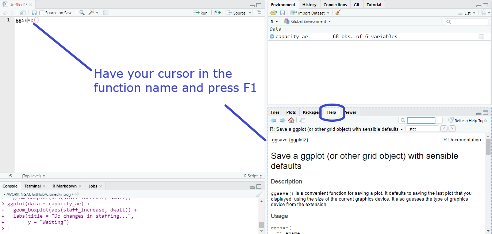
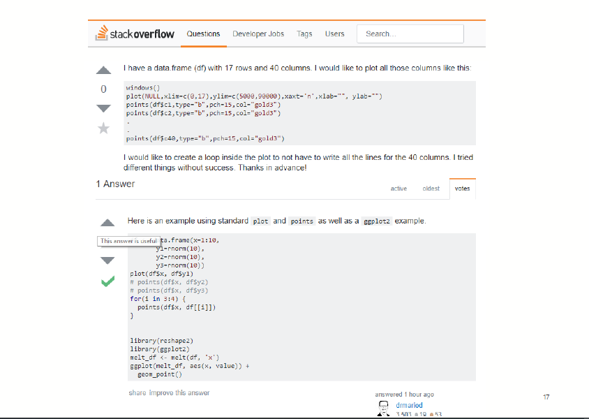
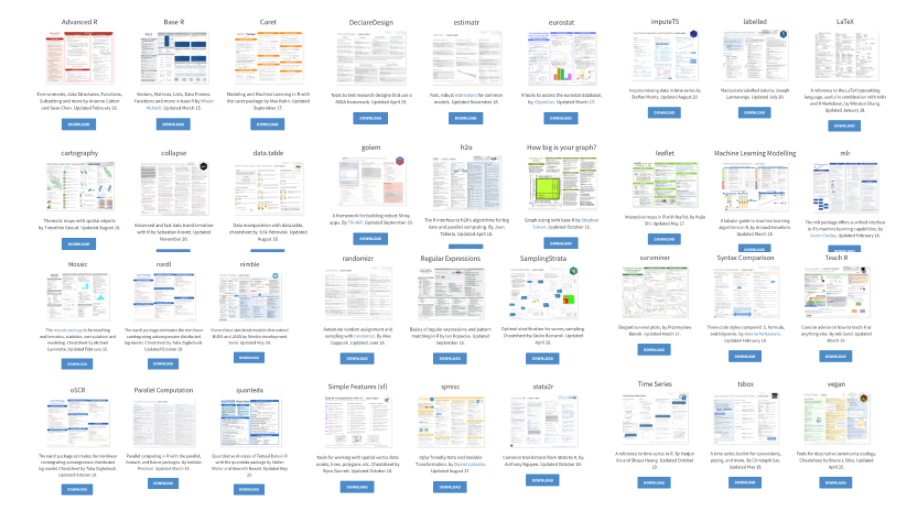
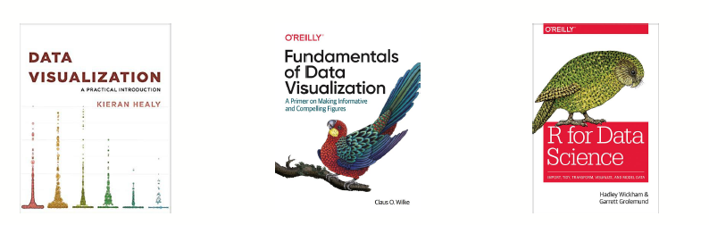

```{r libs, include=FALSE}
library(knitr)
library(tidyverse)
library(xaringan)
library(kableExtra)
library(icons)
library(xaringanExtra)

xaringanExtra::use_panelset()
xaringanExtra::use_clipboard()
xaringanExtra::use_share_again() # need to get the slide button on html view

opts_chunk$set(
  echo = TRUE,
  eval = FALSE,
  message = FALSE,
  warning = FALSE,
  fig.width = 7.252,
  fig.height = 4,
  dpi = 300,
  dev.args = list(type = "cairo")
)
```

class: title-slide, left, bottom

# `r rmarkdown::metadata$title`
----
## **`r rmarkdown::metadata$subtitle`**
### `r rmarkdown::metadata$author`
### `r rmarkdown::metadata$date`

.right-column[

]

---

# What does this function do?



---

# In the console

Either in the script or in the console, typing ? before the function and run if the package is loaded:

```{r eval=FALSE}
?ggsave
```

Or if the package hasn't been loaded using the package::function() format:

```{r eval=FALSE}
?beepr::beep # is loaded in the Cloud
??beep # without the path requires two ?? to be global
```

---

# Getting help on Stackoverflow

... or [R Studio Community](https://community.rstudio.com/) or [NHS-R Slack group](nhsrcommunity.slack.com)



---

# Cheat sheets

Popular packages have cheat sheets and R Studio's can be found [here](https://rviews.rstudio.com/2021/03/10/rstudio-open-source-resorurces/) which download as a pdf.



---

class: center, middle

# Save your script!

Think of your script (rather than the objects) as the "real" part of your analysis.

File `r icons::fontawesome("arrow-right")` Save As… `r icons::fontawesome("arrow-right")` ggplot_intro.R

Or shortcut <kbd>Ctrl + S</kbd> 

---

# Recommended Reading



http://socviz.co/
</br> https://serialmentor.com/dataviz/
</br> https://r4ds.had.co.nz/

All free online as well as available to buy as hardcopies

---

# Art interlude

https://twitter.com/accidental__aRt

</br> 

--

</br> 
</br> 
## Computational aRt 

https://art.djnavarro.net/

https://www.data-imaginist.com/art

---

```{r echo=FALSE, eval=TRUE, out.width="80%"}
lines <- tibble(
  
  x = seq(0, 19, by = .5),
  xend = x,
  y =  rep(0, 39),
  yend = c(rep(c(5, 10), 19), 5))

dots <- lines %>%
  select(x, yend)

ggplot() +
  geom_segment(data = lines,
               aes(x = x, xend = xend,
                   y = y, yend = yend),
               color = "white") +
  geom_point(data = dots,
             aes(x = x, y = yend),
             color = "white") +
  scale_y_continuous(limits = c(-5, 10)) +
  coord_polar() +
  theme(
    plot.background = element_rect(
      fill = "#75926f"),
    panel.background = element_rect(
      fill = "#75926f"),
    panel.grid = element_blank(),
    plot.caption = element_text(
      family = "Open Sans",
      size = 6,
      color = "white"),
    axis.title = element_blank(),
    axis.text = element_blank(),
    axis.ticks = element_blank()
  )

```

[YouTube of the R Ladies talk](https://www.youtube.com/watch?v=h0i6KAahLY8) 
[Source code](https://github.com/Ijeamakaanyene/aRt_ggplot)
[Slides](https://ijeamakaanyene.github.io/aRt_ggplot/index.html#1)

---
#### This work is licensed as
</br> Creative Commons
</br> Attribution
</br> ShareAlike 4.0
</br> International
</br> To view a copy of this license, visit
</br> https://creativecommons.org/licenses/by/4.0/
