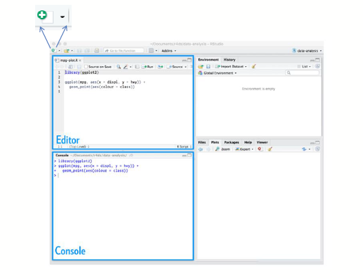
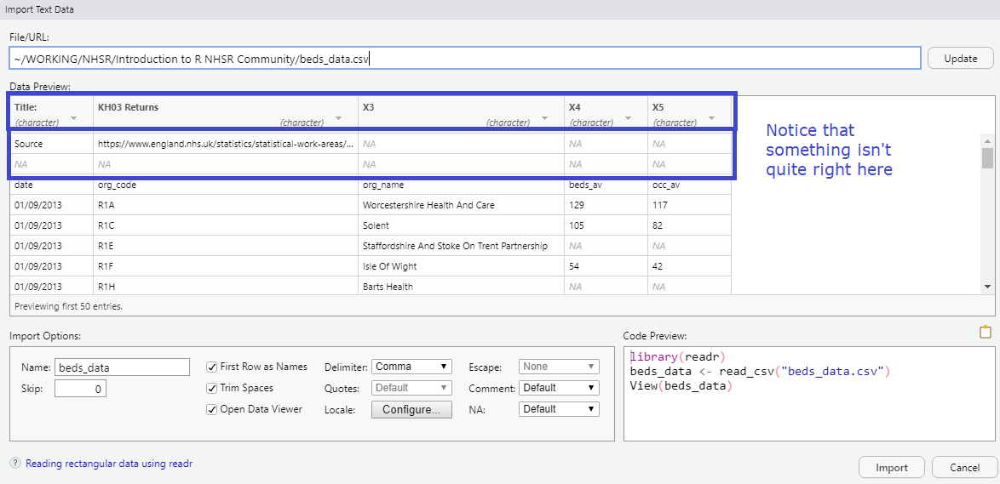
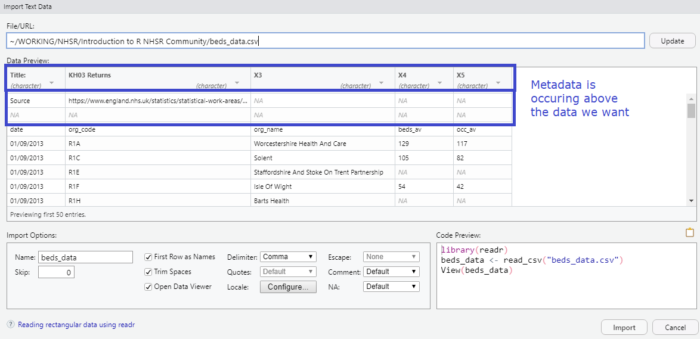
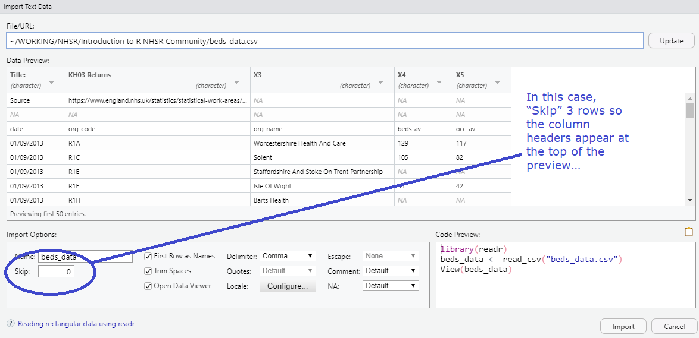
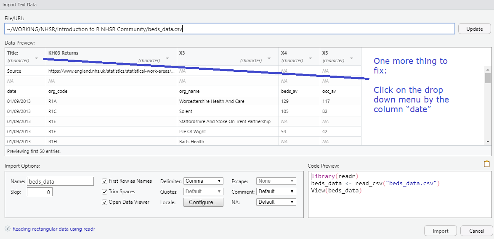
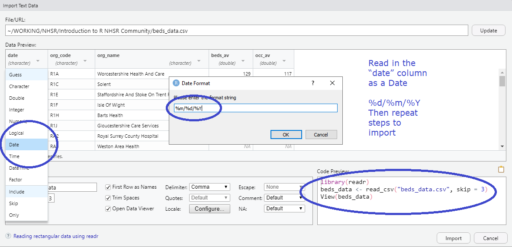
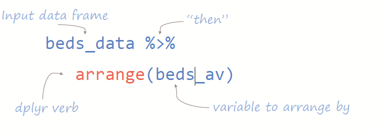
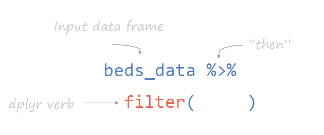

```{r libs, include=FALSE}
library(knitr)
library(magick)
library(tidyverse)
library(xaringan)
library(kableExtra)
library(icons)
library(xaringanExtra)

xaringanExtra::use_panelset()
xaringanExtra::use_clipboard()
xaringanExtra::use_share_again() # need to get the slide button on html view

opts_chunk$set(
  echo = TRUE,
  eval = FALSE,
  message = FALSE,
  warning = FALSE,
  fig.width = 7.252,
  fig.height = 4,
  dpi = 300,
  dev.args = list(type = "cairo")
)

# Load data -----------------------------------
beds_data <- read_csv(url("https://raw.githubusercontent.com/nhs-r-community/intro_r_data/main/beds_data.csv"), col_types = cols(date = col_date(format = "%d/%m/%Y")), 
    skip = 3)

```

class: title-slide, left, bottom


# `r rmarkdown::metadata$title`
----
## **`r rmarkdown::metadata$subtitle`**
### `r rmarkdown::metadata$author`
### `r rmarkdown::metadata$date`

.right-column[

]

.footnote[Artwork by @allison_horst]

---

class: center, middle

# Wrangling

</br> Reshaping or transforming data 
</br> into a format which is easier to work with
</br> (…for later visualisation, modelling, 
</br> or computing of statistics…)

---

# A note on "tidy" data

Tidyverse functions work best with tidy data:

1. Each variable forms a column.
2. Each observation forms a row.

</br> (Broadly, this means long rather than wide tables)

---

class: center, middle

# The tool: dplyr package
.blue[(dee-ply-r)]

is a language for data manipulation </br> 
</br> Most wrangling puzzles can be solved with 
</br> knowledge of just 5 dplyr verbs .blue[(5 functions)]. </br> 
</br> These verbs will be the subject of this session.

---

# Project 2:

## Exploring Mental Health (MH) Inpatient Capacity
--

</br> The following is some analysis of Mental Health inpatient capacity in England.

</br> As part of this, we will be looking at the changes in the number (and occupancy) of MH beds available.

--

### Background

Maintaining clinical effectiveness and safety when a
ward is fully occupied is a serious challenge for staff. 

</br> Inappropriate out of area placements have an added cost and also mean
patients are separated from their social support networks.

---

# The Data:

</br> KH03 returns (bed numbers and occupancy) by organisation, published by NHS England.

</br> Scraped from the NHSE statistics website:

</br> https://www.england.nhs.uk/statistics/statistical-work-areas/bed-availability-and-occupancy/bed-data-overnight/

.blue[partially cleaned]

---

# Start a new script

File/New script or shortcut keys <kbd>Ctrl + Shift + N </kbd>

.left-column[
Load the data
beds_data.csv
]

.right-column[

]

---

# Less friendly csvs



---


# Less friendly csvs



---

# Less friendly csvs

Note you will have to move the cursor to another area for the number to have an effect.



---

# Less friendly csvs



---

# Less friendly csvs



---

# Look at the data

This is real data so there are real issues (which we'll work with)

```{r echo=FALSE, eval=TRUE}

kableExtra::kbl(head(beds_data))
```

---

# Dplyr

5 key verbs will help us gain a deeper understanding of our data sets.

Note summarise() can also be spelt summarize()

```{r}
dplyr::arrange()
dplyr::filter()
dplyr::mutate()
dplyr::group_by()
dplyr::summarise()
```

---

# Building with steps

These verbs aren't used independently of each other. Each can be a step in the code, like a recipe for mashed potato:

.blue[Starts with an...]

</br> potato then 
</br> peel then
</br> slice into medium sized pieces then
</br> boil for 25 minutes then
</br> mash

---

# Building with steps

These verbs aren't used independently of each other. Each can be a step in the code, like a recipe for mashed potato:

.blue[Start with an R object]

</br> **potato** then 
</br> peel then
</br> slice into medium sized pieces then
</br> boil for 25 minutes then
</br> mash

---

# Building with steps

These verbs aren't used independently of each other. Each can be a step in the code, like a recipe for mashed potato:

.blue[Start with an R object]

</br> **potato** then 
</br> **peel()** then
</br> slice into medium sized pieces then
</br> boil for 25 minutes then
</br> mash

---

# Building with steps

These verbs aren't used independently of each other. Each can be a step in the code, like a recipe for mashed potato:

.blue[Start with an R object]

</br> **potato** then 
</br> **peel()** then
</br> **slice(size = "medium")** then
</br> boil for 25 minutes then
</br> mash

---

# Building with steps

These verbs aren't used independently of each other. Each can be a step in the code, like a recipe for mashed potato:

.blue[Start with an R object]

</br> **potato** then 
</br> **peel()** then
</br> **slice(size = "medium")** then
</br> **boil(time = 25)** then

</br> .blue[output = mashed potato]

---

# Building with steps

.grey[These verbs aren't used independently of each other. Each can be a step in the code, like a recipe for mashed potato:]

.blue[input object]

</br> **potato** %>% 
</br> **peel()** %>%
</br> **slice(size = "medium")** %>%
</br> **boil(time = 25)** 

.blue[output = mashed potato]

---

# Tidyverse syntax

.blue[input object]

data_frame .blue[then]
</br>.green[do_this(]rules.green[)] .blue[then]
</br>.green[do_this(]rules.green[)] 

.blue[output = new data frame]

---

# Tidyverse syntax

</br>

data_frame .blue[%>%]
</br>.green[do_this(]rules.green[)] .blue[%>%]
</br>.green[do_this(]rules.green[)] 

---

# Tidyverse syntax

</br> Combine simple pieces to solve complex puzzles

data_frame .blue[%>%]
</br>.green[do_this(]rules.green[)] .blue[%>%]
</br>.green[do_this(]rules.green[)] 

---

class: inverse, middle, center

#Using dplyr

---

class: inverse, center, middle

# Q1. Which organisation provided the highest number of Mental Health (MH) beds?

---

.blue[# 1. arrange]

Reorder rows based on select variable

</br>



```{r arrange}
beds_data %>% 
  arrange(beds_av)
```

--

</br> Shortcut for %>% = <kbd>Ctrl + Shift + m</kbd>

---

.blue[# 1. arrange]

Reorder rows based on select variable...

defaults to ascending order


```{r ref.label="arrange", echo=TRUE, eval=TRUE}

```

---

.blue[# 1. arrange]

We need descending order:

```{r eval=TRUE}

beds_data %>% 
  arrange(desc(beds_av)) #<<
```

</br> desc() works for text and numeric variables

---

class: inverse, center, middle

# Q2. Which 2 organisations provided the highest number of MH beds in September 2018?

---

class: center, middle

# .darkgrey[Q2. Which 2 organisations provided the .blue[highest number] of MH beds in September 2018?]

.pull-left[
We'll use arrange() as before]

---

class: center, middle

# .darkgrey[Q2. Which 2 organisations provided the .blue[highest number] of MH beds .blue[in September 2018?]]

.pull-left[
.darkgrey[We'll use arrange() as before]
</br>
</br> But we require only observations with this date
]

---

.blue[# 2. filter]

pick observations by their value



--

## == is a test of equality

```{r}
beds_data %>% 
  filter(date == "2018-09-01") #<<
```

The expression inside brackets should return TRUE or FALSE.
We are choosing rows where this expression is TRUE.

To exclude and test where the expression is NOT equal `!=`

```{r}
beds_data %>% 
  filter(date != "2018-09-01") #<<
```


---

.blue[# 2. filter]

pick observations by their value

```{r}
beds_data %>% 
  arrange(desc(beds_av)) %>% 
  filter(date == "2018-09-01") #<<
```

---

class: inverse, center, middle

# Q3. Which 5 organisations had the highest percentage bed occupancy in September 2018?

---

class: center, middle

# .darkgrey[Q3. Which 5 organisations had the .blue[highest] percentage bed occupancy in September 2018?]

We'll use arrange() as before

---

class: center, middle

# .darkgrey[Q3. Which 5 organisations had the .blue[highest] percentage bed occupancy in .blue[September 2018?]]

.darkgrey[We'll use arrange() as before]

</br> We'll use filter() as before

---

class: center, middle

# .darkgrey[Q3. Which 5 organisations had the highest .blue[percentage bed occupancy] in September 2018?]

.darkgrey[We'll use arrange() as before]

</br> .darkgrey[We'll use filter() as before]

</br> We don't have this variable...

--

but we can create it

---

.blue[# 3. mutate]

create .green[new variables] from .green[existing ones]

```{r}
beds_data %>% 
  mutate(perc_occ = occ_av / beds_av) #<<
```

</br> perc_occ is a new named column from existing occ_av and beds_av columns

--

## = is NOT a test of equality

---

.blue[# 3. mutate]

create .green[new variables] from .green[existing ones]

```{r}
beds_data %>% 
  mutate(perc_occ = occ_av / beds_av) %>% #<<
  filter(date == "2018-09-01") %>% 
  arrange(desc(perc_occ)) #<<
```

We can refer to variables we've just created above

---

class: inverse, center, middle

# Q4. What was the mean number of beds, (across all trusts) for each value of date?

---

class: center, middle

# .darkgrey[Q4. What was the .blue[mean number of beds], (across all trusts) for each value of date?]

Let's first look at how we'd produce summary statistics like a mean...

---

.blue[# 4. summarise]

collapse many values into a single summary value

```{r summarise}
beds_data %>% 
  summarise(means_beds = mean(beds_av)) #<<
```

</br> Similar in syntax to mutate: means_beds is the new column name

</br> mean() function uses the existing column beds_av

--

The result is NA

```{r ref.label="summarise", eval=TRUE, echo=FALSE}

```

---

.blue[# 4. summarise]

collapse many values into a single summary value

```{r summarise-mean}
beds_data %>% 
  summarise(means_beds = mean(beds_av,
            na.rm = TRUE)) #<<
```

</br> We'll need to remove NA values to get a suitable mean. TRUE can also be T

---

.blue[# 4. summarise]

collapse many values into a single summary value

```{r ref.label="summarise-mean", eval=TRUE}
```

This code produces a single summary value for the whole dataset
---

class: inverse, middle, center

# Q4. What was the mean number of beds (across all trusts) for each value of date?

---

class: middle, center

#.darkgrey[Q4. What was the .blue[mean number of beds] (across all trusts) for each value of date?]

.blue[Now we know how to use summarise...]
---

class: middle, center

#.darkgrey[Q4. What was the mean number of beds (across all trusts) .blue[for each value of date?]]

.darkgrey[Now we know how to use summarise...]

</br> .blue[We'll produce a summary value for **each value of date**]

---

.blue[# 5. group_by]

For each group...

```{r group-by}
beds_data %>% 
  group_by(date) %>% #<<
  summarise(mean_beds = mean(beds_av, 
            na.rm = TRUE))
```

For each value of date...

</br> something must follow a group_by() as it does nothing to the output alone.

The change occurs behind the scenes.

---

.blue[# 5. group_by]

For each group... .darkgrey[summarise() produces a single summary value]

```{r ref.label="group-by", echo=TRUE, eval=TRUE}

```

---

.blue[# 5a. ungroup]

Often it's safest to remove the grouping after you've performed the required operation


```{r}
beds_data %>% 
  group_by(date) %>% 
  summarise(mean_beds = mean(beds_av, na.rm = TRUE)) %>% 
  ungroup()
```

---

class: inverse, middle, center

# Q5. Which 5 organisations have the highest mean % bed occupancy? 
</br>

--
# (over the 5 year period)

---

class: middle, center

# .darkgrey[Q5. Which 5 organisations have the highest mean .blue[% bed occupancy]?] 

.blue[Create a new variable mutate()]

---

class: middle, center

# .darkgrey[Q5. Which 5 .blue[organisations] have the highest mean % bed occupancy?] 

.darkgrey[Create a new variable mutate()] </br> 
</br> .blue[Then, for each of the organisations group_by()]

---

class: middle, center

# .darkgrey[Q5. Which 5 organisations have the highest .blue[mean] % bed occupancy?] 

.darkgrey[Create a new variable mutate() </br> 
</br> Then, for each of the organisations group_by() </br> 
</br> .blue[Summary statistic using summarise()]]
---

class: middle, center

# .darkgrey[Q5. Which 5 organisations have the .blue[highest] mean % bed occupancy?] 

.darkgrey[Create a new variable mutate() </br> 
</br> Then, for each of the organisations group_by() </br> 
</br> Summary statistic using summarise() </br> 
</br> .blue[Order to find highest by using arrange()]]

---

class: middle, center

# .darkgrey[Q5. Which 5 organisations have the .blue[highest] mean % bed occupancy?] 

.darkgrey[Create a new variable mutate() </br> 
</br> Then, for each of the organisations group_by() </br> 
</br> Summary statistic using summarise() </br> 
</br> Order to find highest by using arrange()] </br> 

.pull-left[
.blue[Tip: Run the code after each 
new line to check it returns 
the output you'd expect.]
]

---

class: inverse, middle, center

# Over to you...

---

class: middle, center

# Q5. Which 5 organisations have the highest mean % bed occupancy?

Create a new variable mutate() </br> 
</br> Then, for each of the organisations group_by() </br> 
</br> Summary statistic using summarise() </br> 
</br> Order to find highest by using arrange() </br> 

.pull-left[
.blue[Tip: Run the code after each 
new line to check it returns 
the output you'd expect.]
]

.pull-right[
Hint:

```{r}
beds_data %>% 
  mutate() %>% 
  group_by() %>% 
  summarise() %>% 
  arrange()
```
]

---

# Solution

```{r, eval=TRUE}
beds_data %>% 
  mutate(perc_occ = occ_av/beds_av) %>% 
  group_by(org_name) %>% 
  summarise(mean_pocc = mean(perc_occ, na.rm = TRUE)) %>% 
  arrange(desc(mean_pocc))
```

---

# Extension

How many distinct organisation names are counted under the same organisation code? 

```{r eval=TRUE}
beds_data %>% 
  mutate(perc_occ = occ_av/beds_av) %>% 
  group_by(org_name) %>% 
  summarise(mean_pocc = mean(perc_occ, na.rm = TRUE),
            # Number of data points/rows by group
            number = n()) %>% #<< 
  arrange(desc(mean_pocc))
```

---

# Extension

How many columns associated with each observation?

Adds another summary column.

```{r eval=TRUE}
beds_data %>% 
  group_by(org_code) %>% 
  summarise(# distinct number of org_name
            distinct_number = n_distinct(org_name)) %>% #<< 
  filter(distinct_number > 1) %>% 
  arrange(desc(distinct_number))
```

---

.blue[# 6. select]

select a subset of variables .darkgrey[from a existing data set]

```{r}
beds_data %>% 
  select(org_code, 
         org_name)
```

---

.blue[# 6. select]

select a subset of variables .darkgrey[from a existing data set]

```{r}
beds_data %>% 
  select(-org_code)
```

.green[To remove a column]

---

.blue[# 6. select]

select a subset of variables .darkgrey[from a existing data set]

```{r}
beds_data %>% 
  select(1:3)
```

.green[You can also refer to columns by number, here 1:3 saves having to type 1, 2, 3]

---

.blue[# 6. select]

select a subset of variables .darkgrey[from a existing data set]

```{r}
beds_data %>% 
  select(org_name,
         everything())
```

.green[org_name appears first, followed by everything else - and isn't repeated]

---

# Not dplyr...

... but works within dplyr

[Vectors](https://datascienceplus.com/vectors-and-functions-in-r/) are the simplest type of data structure in R. Simply put, a vector is a sequence of data elements of the same basic type.

--

You can create a vector with function: c() for concatenate/combine

```{r}
c(100, 80, 200)

c("beds", "staff", "patients")

c("beds", 80, "patients") # Mixing strings (characters) and numeric values results in all being strings
```

---

# Very useful in these circumstances

```{r}

c("Bradford District Care", "Bradford District Care Trust")

```

</br> Filter by org_name IN the lookup list.

```{r }
beds_data %>% 
  filter(org_name %in% c("Bradford District Care", "Bradford District Care Trust")) #<<
```

</br> Filter by org_name NOT IN the lookup list.

```{r }
beds_data %>% 
  filter(!org_name %in% c("Bradford District Care", "Bradford District Care Trust")) #<<
```

---

# For SQL users

Code would look like this in SQL

```{sql }

SELECT *
FROM Table
WHERE Colm IN ('Bradford District Care', 'Bradford District Care Trust')

```

And

```{sql}
SELECT *
FROM Table
WHERE Colm NOT IN ('Bradford District Care', 'Bradford District Care Trust')
```


---

#### This work is licensed as
</br> Creative Commons
</br> Attribution
</br> ShareAlike 4.0
</br> International
</br> To view a copy of this license, visit
</br> https://creativecommons.org/licenses/by/4.0/
