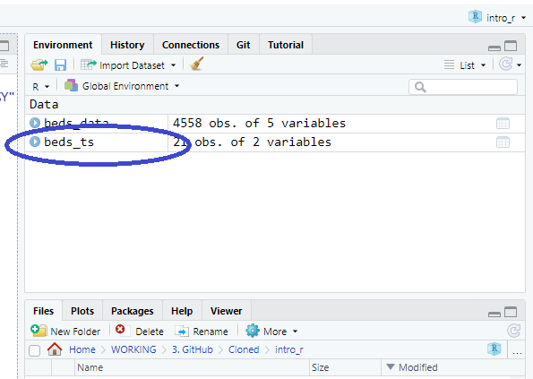

```{r libs, include=FALSE}
library(knitr)
library(magick)
library(tidyverse)
library(xaringan)
library(kableExtra)
library(icons)
library(xaringanExtra)

xaringanExtra::use_panelset()
xaringanExtra::use_clipboard()
xaringanExtra::use_share_again() # need to get the slide button on html view

opts_chunk$set(
  echo = TRUE,
  eval = FALSE,
  message = FALSE,
  warning = FALSE,
  fig.width = 7.252,
  fig.height = 4,
  dpi = 300,
  dev.args = list(type = "cairo")
)

# Load data -----------------------------------

beds_data <- read_csv(url("https://raw.githubusercontent.com/nhs-r-community/intro_r_data/main/beds_data.csv"), col_types = cols(date = col_date(format = "%d/%m/%Y")), 
    skip = 3)

```

class: title-slide, left, bottom

# `r rmarkdown::metadata$title`
----
## **`r rmarkdown::metadata$subtitle`**
### `r rmarkdown::metadata$author`
### `r rmarkdown::metadata$date`

.right-column[

]

---

# Let's revisit our dplyr session:

</br> The mean number of beds available by date

```{r eval=TRUE}
beds_data %>% 
  group_by(date) %>% 
  summarise(mean_beds = mean(beds_av, na.rm = TRUE))

```

</br> Output = Object = New data frame!

---

class: inverse, middle, center

# Next step: Visualise

---

# Piecing it together

We can put the output...

```{r }

    beds_data %>%
         group_by(date) %>% 
         summarise(mean_beds = mean(beds_av, na.rm = TRUE)) 

```

</br> ... into ggplot2 code...

```{r}
ggplot(
         beds_data %>% #<<
         group_by(date) %>% #<<
         summarise(mean_beds = mean(beds_av, na.rm = TRUE)) #<<
) + 
   geom_point(aes(x = date, y = mean_beds))

```

---

class: center, middle

# But, it's often better to:

## Keep wrangling separate

---

class: center, middle

# And it's <ins>always</ins> better to:

## Keep your code .green[as] readable .green[as possible]

---

# Solution:

This whole 'chunk' of code can be named

```{r}
# name = 

beds_data %>% 
  group_by(date) %>% 
  summarise(mean_beds = mean(beds_av, na.rm = TRUE))

```

--

</br> With this:

```{r}
beds_ts <- beds_data %>% #<<
  group_by(date) %>% 
  summarise(mean_beds = mean(beds_av, na.rm = TRUE))

```

---

# Good (object) names are:

</br> 1. Descriptive
</br>
</br> 2. Short.blue[(ish)]
</br>
</br> 3. Consistent .blue[with other names]

--

</br> 
</br> Whilst = will work, R convention is to use the following assignment operator:

```{r eval=FALSE}
<- 
```

Shortcut: <kbd> Alt - </kbd>
---

# What happens when the code is run?

The code creates an object which can be seen in the top right quadrant Environment pane



And this can be viewed by running the code line:

```{r}
beds_ts
```

---
# Returning to the plot

The long code used to create the dataset

```{r}
ggplot(data = beds_data %>% #<<
         group_by(date) %>% #<<
         summarise(mean_beds = mean(beds_av, na.rm = TRUE))) + #<<
     geom_point(aes(x = date, y = mean_beds)) #<<
```

--

</br> 
Becomes...

```{r}
ggplot(data = beds_ts) + #<<
     geom_point(aes(x = date, y = mean_beds))
```

---

# Your turn

Give your plot a name

```{r}
# plot = 

ggplot(data = beds_ts) +
     geom_point(aes(x = date, y = mean_beds))

```

Then run your plot

```{r}
# plot
```

---

# Solution

```{r}

plot <- ggplot(data = beds_ts) + #<<
     geom_point(aes(x = date, y = mean_beds))

plot #<<
```

---

# Naming style

The way names are written out is a question of style but it's best to be consistent. 

The two common forms in R are camelCase and snake_case but others are:

```{r}
camelCase # first letter is small case

PascalCase # every letter is capital

snake_case # lower case and words are separated with underline

kebab-case # lower case and hyphen, used in RMarkdown but not R scripts
```

---

#### This work is licensed as
</br> Creative Commons
</br> Attribution
</br> ShareAlike 4.0
</br> International
</br> To view a copy of this license, visit
</br> https://creativecommons.org/licenses/by/4.0/
