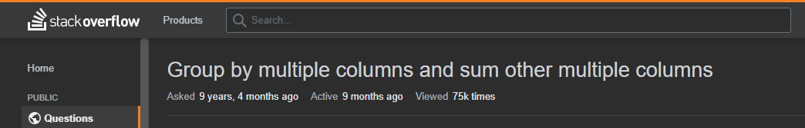
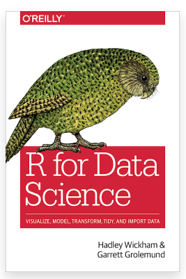
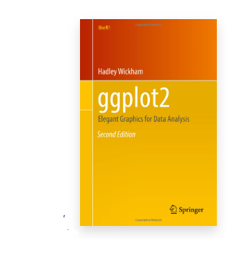

```{r libs, include=FALSE}
library(knitr)
library(magick)
library(tidyverse)
library(xaringan)
library(kableExtra)
library(icons)
library(xaringanExtra)

xaringanExtra::use_panelset()
xaringanExtra::use_clipboard()
xaringanExtra::use_share_again() # need to get the slide button on html view

opts_chunk$set(
  echo = TRUE,
  eval = FALSE,
  message = FALSE,
  warning = FALSE,
  fig.width = 7.252,
  fig.height = 4,
  dpi = 300,
  dev.args = list(type = "cairo")
)
```

class: title-slide, left, bottom

# `r rmarkdown::metadata$title`
----
## **`r rmarkdown::metadata$subtitle`**
### `r rmarkdown::metadata$author`
### `r rmarkdown::metadata$date`

.right-column[

]

---

class: center

# Ongoing learning

</br> Learning R is not unlike learning a spoken language: </br>
</br> Unfortunately it takes time to build vocab and learn syntax. </br>
</br> Regular (even total) immersion is the best way to progress. </br>
</br>
</br> Will reward you if you can make the investment

---

class: center

# Quick fix

--

# What if you get stuck?

## Google (Stack Overflow) Strategy

---

class: center

# Stack Overflow Strategy

</br> Require vocabulary to describe the problem (which you may not have right away) </br> 
</br> There is more than one style of writing R! </br> 
</br> Best to find the style that you're already using. </br> 
</br> 
Beware the date of answer.

---

class: center

# Stack Overflow Strategy

##Example:

[](https://stackoverflow.com/questions/8212699/group) 

---

# Longer term fixes - books (online and paper)

--

.pull-left[
[](https://r4ds.had.co.nz/) 
]

.pull-right[
[](https://ggplot2-book.org/) 
]
---

# Longer term fixes - books (online only)

[](https://www.bigbookofr.com/index.html)

---

# Longer term fixes - blogs

</br> https://rweekly.org/ </br>
</br> https://www.r-bloggers.com/ </br>
</br> [NHS-R Community blog](https://nhsrcommunity.com/blog/) - you can contribute to it too!

---

# Longer term fixes - Social Media

</br> Twitter - [#rstats](https://twitter.com/search?q=%23rstats&src=typed_query&f=live) </br>
</br> [NHS-R Slack](https://nhsrcommunity.slack.com) channel </br>
</br> [Government Data Science](https://govdatascience.slack.com) channel - access only with certain email addresses and for NHS this is nhs.net


---

# File and Project structures

Jenny Bryan's Presentation on [How to Name Files](https://speakerdeck.com/jennybc/how-to-name-files?slide=6) </br>

</br>
Danielle Navarro's Presentation (based on Jenny's) on [Project Structure](https://slides.djnavarro.net/project-structure/#1) supported with [YouTube videos](https://www.youtube.com/playlist?reload=9&list=PLRPB0ZzEYegPiBteC2dRn95TX9YefYFyy)

<iframe src="https://slides.djnavarro.net/project-structure/#1" width="600" height="400" loading="lazy" allowfullscreen></iframe> <script>fitvids('.shareagain', {players: 'iframe'});</script>

---

#### This work is licensed as
</br> Creative Commons
</br> Attribution
</br> ShareAlike 4.0
</br> International
</br> To view a copy of this license, visit
</br> https://creativecommons.org/licenses/by/4.0/
